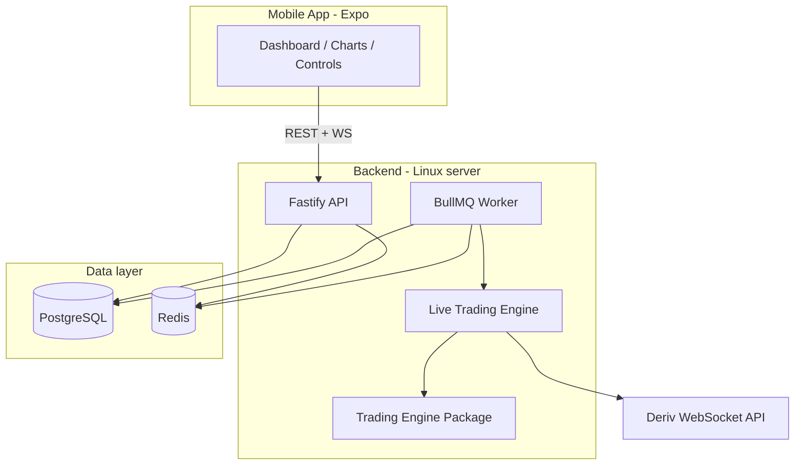

# RegimeX

**Experimental regime-aware trading research platform for Deriv synthetic indices — demo accounts only.**

RegimeX is a mobile-controlled backend system that:

1. Streams live market data from Deriv
2. Aggregates ticks into candles and computes indicators
3. Classifies the current market regime (rule-based, deterministic)
4. Selects the best validated strategy for that regime
5. Runs event-driven backtests with train/test validation
6. Optionally executes trades on a **Deriv demo account** (disabled by default)

> **Safety disclaimer:** RegimeX is a research tool. It does **not** promise profitability. Backtest and simulated results are **not guarantees** of future performance. Live-money trading is **disabled** at both UI and backend levels in this MVP.

## Architecture



| Layer | Responsibility |
|-------|----------------|
| `apps/mobile` | Auth, dashboard, charts, engine controls — **no trading logic** |
| `apps/api` | REST, WebSocket fan-out, auth, job enqueue |
| `apps/worker` | Backtests, market-data jobs, live engine loop |
| `packages/trading-engine` | Regime, strategies, backtester, risk, Deriv client |
| `packages/indicators` | Deterministic indicator library |
| `packages/database` | Prisma schema, migrations, seed |

## Quick start (local development)

### Prerequisites

- Node.js 20+
- pnpm 9+
- Docker (for PostgreSQL + Redis) **or** local installs

### 1. Install

```bash
pnpm install
cp .env.example .env
# Edit .env — set JWT secrets and CREDENTIAL_ENCRYPTION_KEY
```

Generate secrets:

```bash
openssl rand -hex 32   # JWT_ACCESS_SECRET
openssl rand -hex 32   # JWT_REFRESH_SECRET
openssl rand -hex 32   # CREDENTIAL_ENCRYPTION_KEY
```

### 2. Start infrastructure

```bash
docker compose up -d postgres redis
# Or full stack:
pnpm docker:up
```

### 3. Database

```bash
pnpm db:generate
pnpm db:push      # apply schema (dev)
pnpm db:seed      # symbols, strategies, dev user, mock candles
```

### 4. Run backend

```bash
pnpm dev          # API + worker in parallel
# Or separately:
pnpm dev:api
pnpm dev:worker
```

API: `http://localhost:4000`  
Health: `GET /health`, `GET /health/ready`, `GET /health/live`

### 5. Run mobile app

```bash
pnpm dev:mobile
```

Set `EXPO_PUBLIC_API_URL` to your machine IP when using a physical device.

### Dev credentials

After seeding (with `SEED_DEV_USER=true` and `SEED_MOCK_CANDLES=true` in `.env`):

| Field | Value |
|-------|-------|
| Email | `dev@regimex.local` |
| Password | `Passw0rd!?` |

Connect a **Deriv demo API token** via Settings (create at [Deriv API token page](https://app.deriv.com/account/api-token)).

## Commands

| Command | Description |
|---------|-------------|
| `pnpm install` | Install all workspace dependencies |
| `pnpm dev` | API + worker (watch mode) |
| `pnpm dev:mobile` | Expo dev server |
| `pnpm typecheck` | TypeScript across all packages |
| `pnpm test` | Vitest (backend packages) |
| `pnpm lint` | ESLint (backend packages) |
| `pnpm build` | Build check (excludes mobile) |
| `pnpm db:generate` | Prisma client generate |
| `pnpm db:push` | Apply schema (development) |
| `pnpm db:migrate` | Prisma migrate dev |
| `pnpm db:seed` | Seed symbols, strategies, dev user |
| `pnpm docker:up` | Docker Compose full stack |
| `pnpm docker:down` | Stop containers |

## Vertical slice (MVP)

1. Register / login
2. Connect Deriv **demo** token (encrypted server-side)
3. Select synthetic symbol (R_10 … R_100)
4. Download historical candles
5. Run backtest with regime-aware strategy selection
6. View results in mobile app (equity curve, per-regime breakdown)
7. Start **analysis-only** live engine
8. See live regime, strategy, signals, decision log
9. Demo trade execution exists but is **off by default** (`DEMO_TRADING_ENABLED=false`)
10. Emergency stop + risk limits enforced before any demo trade

## Documentation

| Doc | Topic |
|-----|-------|
| [ARCHITECTURE.md](./ARCHITECTURE.md) | System design and package boundaries |
| [DERIV_INTEGRATION.md](./DERIV_INTEGRATION.md) | WebSocket client, auth, demo-only enforcement |
| [BACKTESTING.md](./BACKTESTING.md) | Event-driven backtester, validation |
| [STRATEGIES.md](./STRATEGIES.md) | Strategy catalogue and eligibility |
| [RESEARCH.md](./RESEARCH.md) | Walk-forward validation, holdout, research confidence |
| [DATASET.md](./DATASET.md) | ML-ready TradeCandidate export format |
| [RISK_MANAGEMENT.md](./RISK_MANAGEMENT.md) | Pre-trade checks and limits |
| [MOBILE_APP.md](./MOBILE_APP.md) | Expo app structure |
| [DEPLOYMENT_AWS.md](./DEPLOYMENT_AWS.md) | EC2 production guide |
| [SECURITY.md](./SECURITY.md) | Credential encryption, auth |
| [DEVELOPMENT.md](./DEVELOPMENT.md) | Contributor workflow |
| [TASKS.md](./TASKS.md) | Phase checklist |

## Deployment

- [DEPLOYMENT_RENDER.md](./DEPLOYMENT_RENDER.md) — **Render** (recommended): Blueprint + mobile APK
- [DEPLOYMENT_AWS.md](./DEPLOYMENT_AWS.md) — EC2 + Docker Compose + Nginx + HTTPS

## License

Private — all rights reserved.
